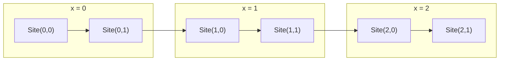

# DMRG Mapping for the Two-Layer Kondo Model

This document explains how the 2D two-layer square lattice system is mapped onto a 1D chain for the DMRG calculations in this project.

## Lattice Structure

The model consists of two square lattices stacked on top of each other. Each site `(i, \ell)` in the lattice contains two degrees of freedom:
1.  An **itinerant electron** (c-particle) that can hop between sites.
2.  A **localized spin** (S-particle) that is fixed to its site.

-   `i` is the spatial index within a layer.
-   `\ell` is the layer index (`\ell \in \{1, 2\}`).

## 2D to 1D Mapping ("Snake" Pattern)

To be simulated with DMRG, which is natively a 1D method, the 2D lattice must be mapped onto a 1D chain. We use a standard "snake" pattern. The sites are ordered first by their **x-coordinate**, then by their **y-coordinate**, and finally by the **on-site degree of freedom** (itinerant vs. localized) and **layer**.

For a system with `Lx=3` sites in the x-direction and `Ly=2` sites in the y-direction, the mapping proceeds as follows:

1.  Start at `x=0, y=0`. The DMRG block is `Site(0,0)`.
2.  Move to the next y-position `y=1`. The DMRG block is `Site(0,1)`.
3.  After completing all y-positions for `x=0`, move to the next x-position `x=1` and repeat the process, visiting `Site(1,0)` then `Site(1,1)`.
4.  Continue until all sites are mapped.

This creates a 1D chain where the full order would be: `Site(0,0)`, `Site(0,1)`, `Site(1,0)`, `Site(1,1)`, `Site(2,0)`, `Site(2,1)`.

### 2×3 Lattice Grid

Below is a simple 2 × 3 grid showing the spatial arrangement of the sites. The x-coordinate runs horizontally, the y-coordinate vertically. Each Block `Site(x,y)` represent four sites: (itinerate layer 1, localize layer1, itinerate layer2, localize layer2).

This mapping ensures that while the intra-layer y-direction and inter-layer couplings become next-nearest neighbor interactions in the 1D chain, the dominant x-direction hopping remains long-range, which is effectively handled by the DMRG algorithm.
